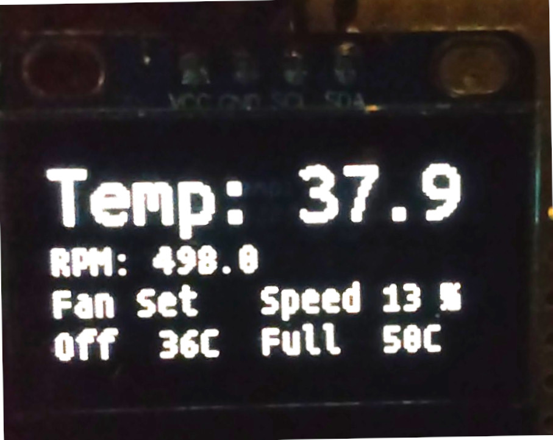
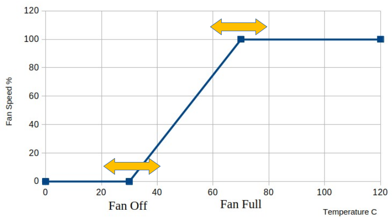
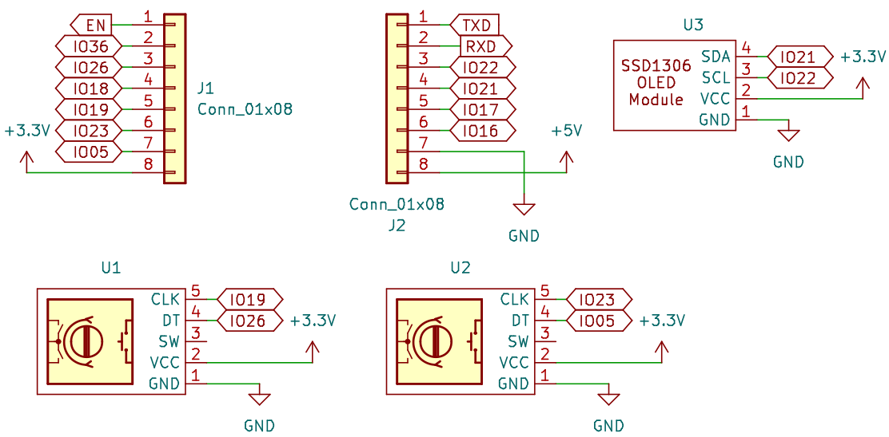
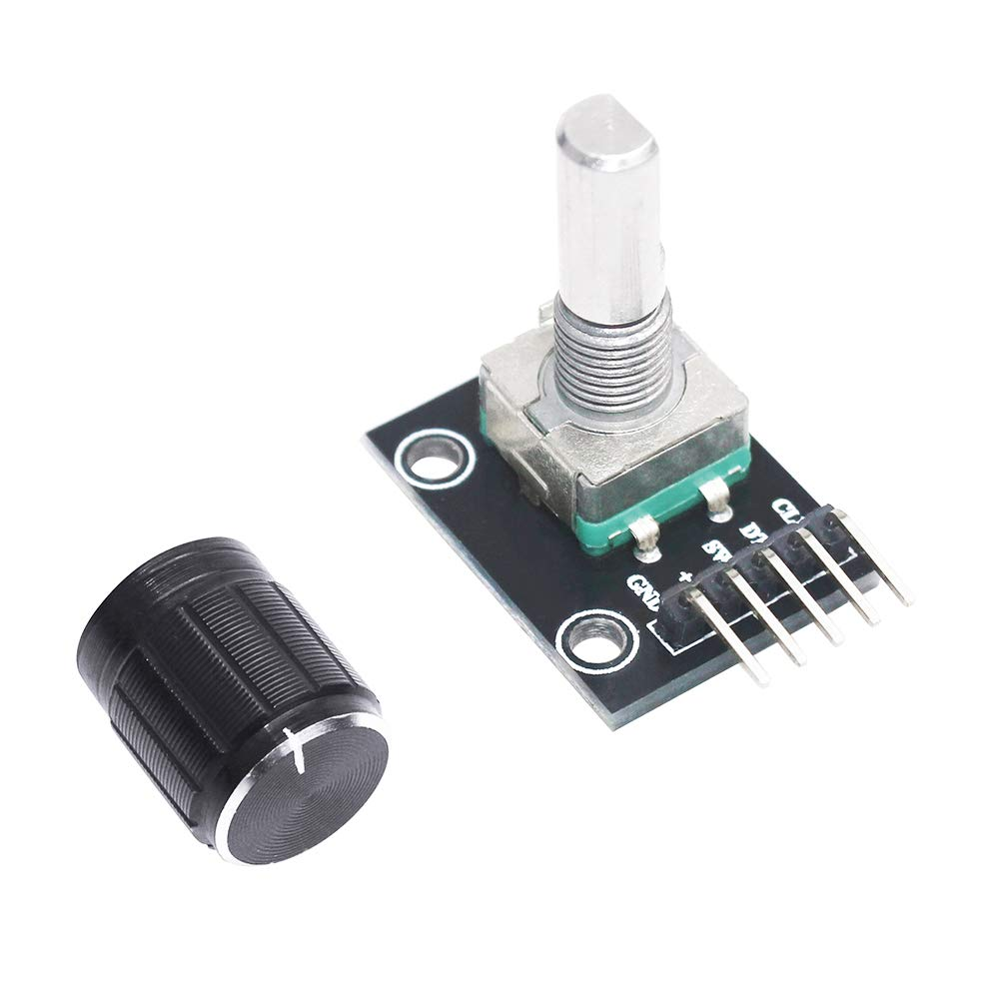
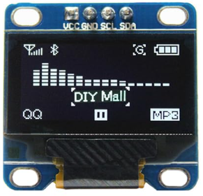

<h3>ESPHome based PWM fan controller</h3>
This fan controller uses the ESP32 Control Board Ver. 2.1  
<a href="https://www.tindie.com/products/esp32/esp32-control-board-ver-21/">
https://www.tindie.com/products/esp32/esp32-control-board-ver-21/</a> 
and adds an expansion module with a display and two rotary encoders. 
 
The fan controller works without any USB or Internet connection and allows the user to view
all relevant data and set all necessary parameters. 
Additionally, the user may connect to the module via Wifi and remotely view more data and change settings, if desired.  

    
    

The left button changes the temperature at which the fan turns off 
the right button changes the temperature at which the fan runs at full speed. 

    

 
<h4>Circuit Diagram</h4>

    

 
<h4>Parts</h4>

<a href="https://www.amazon.com/dp/B07T3672VK">
https://www.amazon.com/dp/B07T3672VK</a> 
 

<a href="https://www.amazon.com/dp/B0C9LJ898Z">
https://www.amazon.com/dp/B0C9LJ898Z</a> 

<h4>Source Code</h4>
<a href="https://github.com/atmelino/fancontroller/tree/main/sourcecode/ESPHome">
https://github.com/atmelino/fancontroller/tree/main/sourcecode/ESPHome</a> 

